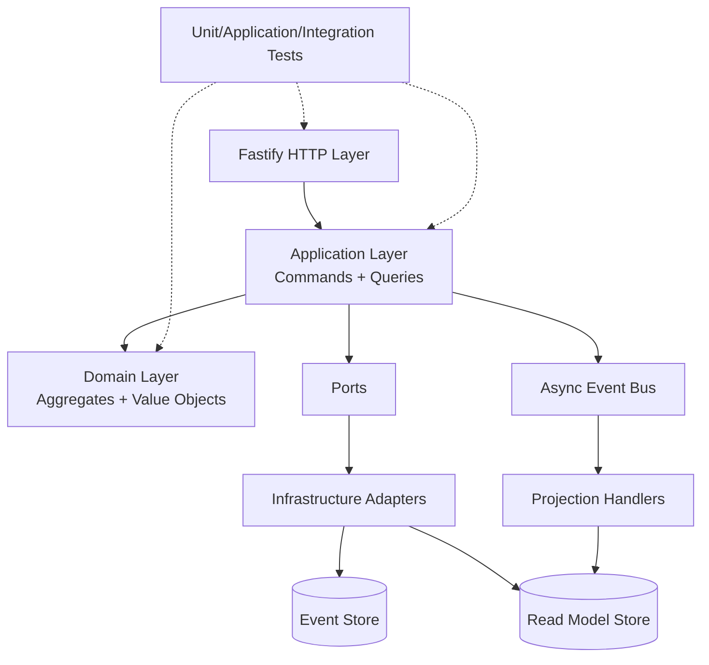

# Container / Architecture Overview

```mermaid
flowchart TB
  HTTP[Fastify HTTP Layer] --> APP[Application Layer\nCommands + Queries]
  APP --> DOM[Domain Layer\nAggregates + Value Objects]
  APP --> PORTS[Ports]
  PORTS --> INFRA[Infrastructure Adapters]
  INFRA --> ES[(Event Store)]
  INFRA --> RMS[(Read Model Store)]
  APP --> BUS[Async Event Bus]
  BUS --> PROJ[Projection Handlers]
  PROJ --> RMS
  TESTS[Unit/Application/Integration Tests] -.-> HTTP
  TESTS -.-> APP
  TESTS -.-> DOM
```

Trade-off: in-memory adapters simplify demo while preserving extension points.
