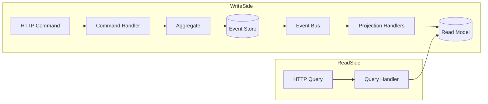

# CQRS Flow Diagram

```mermaid
flowchart LR
  subgraph WriteSide
    C[HTTP Command] --> CH[Command Handler]
    CH --> AGG[Aggregate]
    AGG --> ES[(Event Store)]
    ES --> EB[Event Bus]
    EB --> PH[Projection Handlers]
    PH --> RM[(Read Model)]
  end

  subgraph ReadSide
    Q[HTTP Query] --> QH[Query Handler]
    QH --> RM
  end
```

Event sourcing is on write side for invoice; read side is projection-first.
