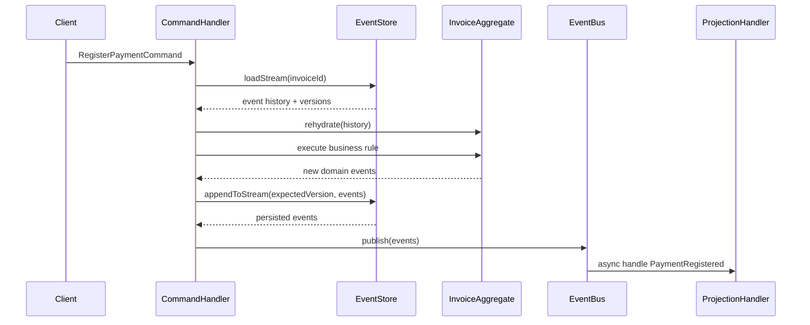

# Event Sourcing Lifecycle Diagram

```mermaid
sequenceDiagram
  participant Client
  participant Cmd as CommandHandler
  participant ES as EventStore
  participant Agg as InvoiceAggregate
  participant Bus as EventBus
  participant Proj as ProjectionHandler

  Client->>Cmd: RegisterPaymentCommand
  Cmd->>ES: loadStream(invoiceId)
  ES-->>Cmd: event history + versions
  Cmd->>Agg: rehydrate(history)
  Cmd->>Agg: execute business rule
  Agg-->>Cmd: new domain events
  Cmd->>ES: appendToStream(expectedVersion, events)
  ES-->>Cmd: persisted events
  Cmd->>Bus: publish(events)
  Bus->>Proj: async handle PaymentRegistered
```

Optimistic concurrency protects against double write race.
