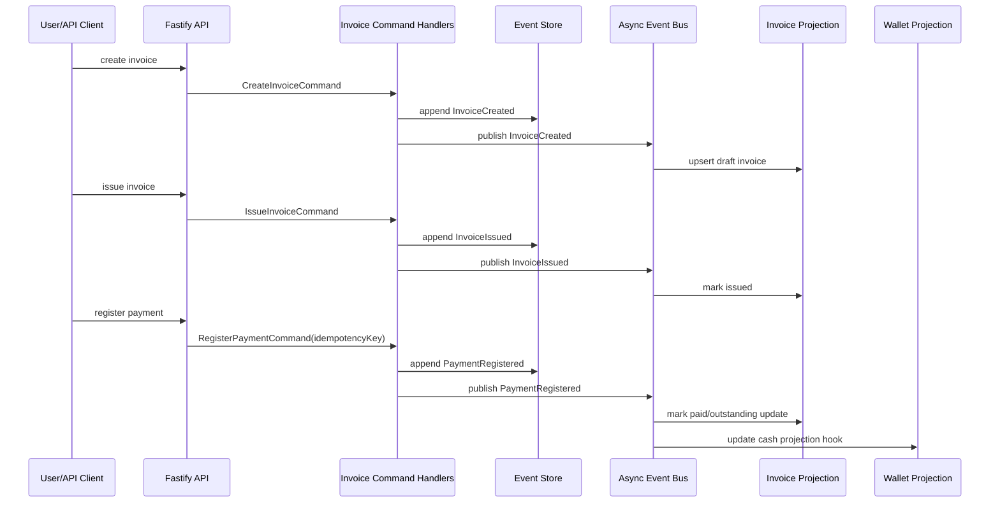

# Sequence Diagram: Invoice Payment Flow

```mermaid
sequenceDiagram
  participant U as User/API Client
  participant API as Fastify API
  participant INV as Invoice Command Handlers
  participant ES as Event Store
  participant BUS as Async Event Bus
  participant PROJ as Invoice Projection
  participant WAL as Wallet Projection

  U->>API: create invoice
  API->>INV: CreateInvoiceCommand
  INV->>ES: append InvoiceCreated
  INV->>BUS: publish InvoiceCreated
  BUS->>PROJ: upsert draft invoice

  U->>API: issue invoice
  API->>INV: IssueInvoiceCommand
  INV->>ES: append InvoiceIssued
  INV->>BUS: publish InvoiceIssued
  BUS->>PROJ: mark issued

  U->>API: register payment
  API->>INV: RegisterPaymentCommand(idempotencyKey)
  INV->>ES: append PaymentRegistered
  INV->>BUS: publish PaymentRegistered
  BUS->>PROJ: mark paid/outstanding update
  BUS->>WAL: update cash projection hook
```
