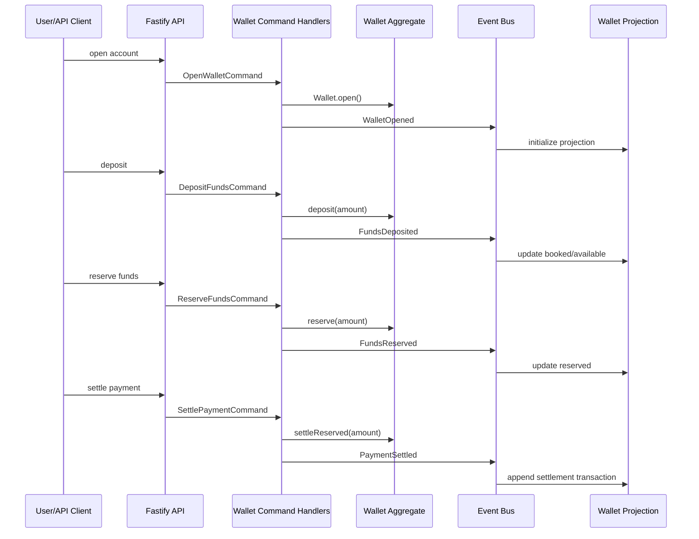

# Sequence Diagram: Wallet Flow

```mermaid
sequenceDiagram
  participant U as User/API Client
  participant API as Fastify API
  participant CMD as Wallet Command Handlers
  participant W as Wallet Aggregate
  participant BUS as Event Bus
  participant PROJ as Wallet Projection

  U->>API: open account
  API->>CMD: OpenWalletCommand
  CMD->>W: Wallet.open()
  CMD->>BUS: WalletOpened
  BUS->>PROJ: initialize projection

  U->>API: deposit
  API->>CMD: DepositFundsCommand
  CMD->>W: deposit(amount)
  CMD->>BUS: FundsDeposited
  BUS->>PROJ: update booked/available

  U->>API: reserve funds
  API->>CMD: ReserveFundsCommand
  CMD->>W: reserve(amount)
  CMD->>BUS: FundsReserved
  BUS->>PROJ: update reserved

  U->>API: settle payment
  API->>CMD: SettlePaymentCommand
  CMD->>W: settleReserved(amount)
  CMD->>BUS: PaymentSettled
  BUS->>PROJ: append settlement transaction
```
